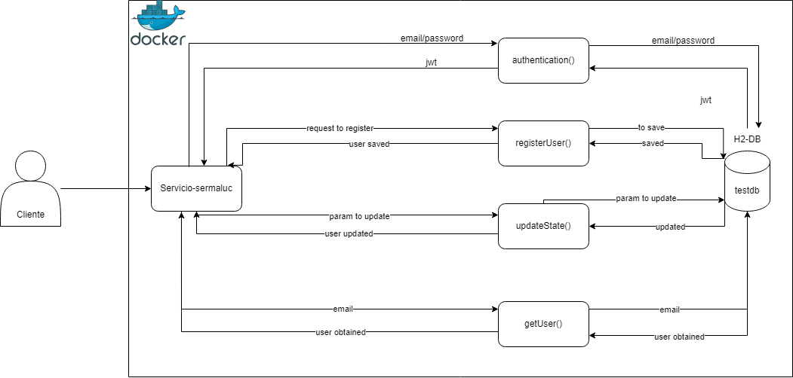

# Prueba técnica Evaluación Java

_Se realizaron servicios de autenticación, creación de usuarios, actualizar el estado del usuario y conseguir el usuario por el id._

## Pre-requisitos 📋

* _Las versiones son las siguientes: Java 17 y mvn 3.6.3 (pueden usar la versión embebida de IntelliJ)_

_Para levantar localmente el servicio se puede realizar de 2 maneras:_

#### Con el IDE IntelliJ 🔧

* _Realizar un git clone al repositorio._
* _Abrir el proyecto con IntelliJ._
* _Realizar el comando maven:_
```
    mvn clean install
```
* _Ejecutar el proyecto con el Starter:_
* _Si entramos al siguiente link debería responder el siguiente Json:_
```
    http://localhost:8089/actuator/health
```
```
    JSON:
    {
        "status": "UP"
    }
```
* _Tendremos acceso a la documentación en el siguiente link:_
```
    http://localhost:8089/swagger-ui/index.html
```
#### Con Docker 🔧

* _Realizar un git clone al repositorio._
* _Abrir el proyecto con el explorador de archivos y abrir la terminal._
* _Realizar la siguiente secuencia de comandos:_

```
    mvn clean install
    docker build -t sermaluc .
    docker run -d -p 8089:8089 -t sermaluc:latest sermaluc
```

## Probar con Postman 📋

_Para crear nuevos usuarios._
```
    http://localhost:8089/v1/user/register
```
_Para actualizar el estado. (Cambiar el email y el state por los valores deseados) el email debe tener el formato de correo y el state puede ser "true" o "false"._
```
    http://localhost:8089/v1/user/update/state?email={email}@prueba.com&state={email}
```
_Para obtener el usuario por email._
```
    http://localhost:8089/v1/user?email={email}
```
_Para generar el JWT mediante el logeo de un usuario. Tener en cuenta que la data de prueba proporcionada es el usuario que se registra cuando se inicia la aplicación. Con esta data generaremos el JWT necesario para crear nuevos usuarios._
```
    http://localhost:8089/v1/auth
    Request para generar el JWT:
    {
        "email": "wpalomino@prueba.com",
        "password": "Elmaestro1$"
    }
```

## Diagrama de Solución 📋

---
⌨️ por [Wilmer Palomino](https://github.com/WilGP02) 😊